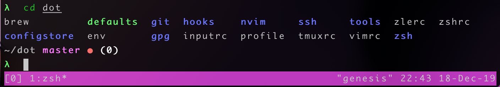

# README

## Not much but still a README! :)

My dotfiles are mainly for me and it's not exactly usable for someone
else yet. I'm focused on support for C++ in NeoVim (and Rust!).

Also, I use zsh with a nice little customized prompt made with the help
from thoughtbot:

