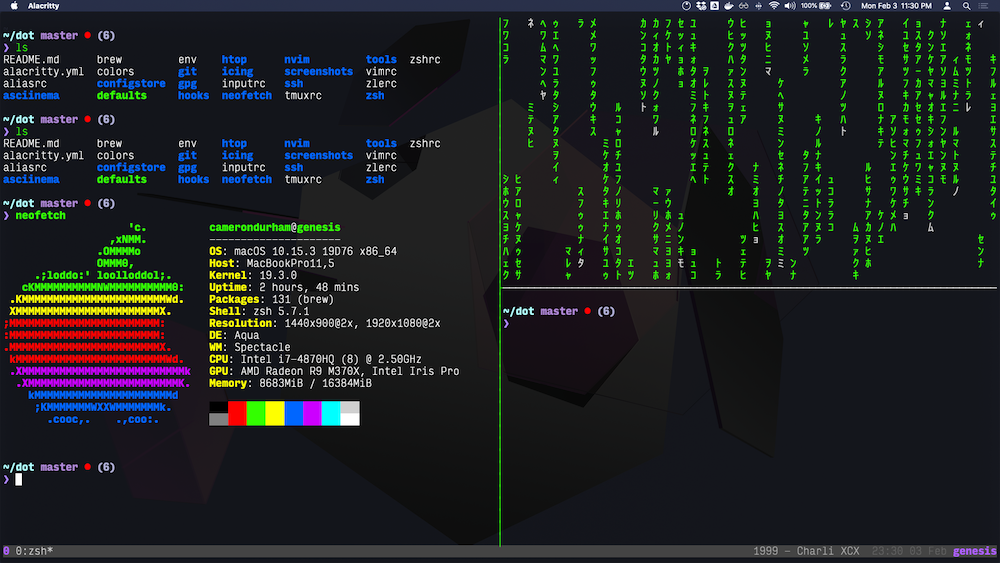
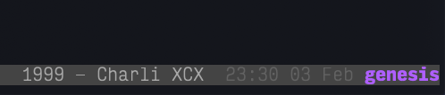

# README



## Not much but still a README! :)

My dotfiles are mainly for me and it's not exactly usable for someone
else yet. I'm focused on support for C++ in NeoVim (and Rust!).

Also, I use zsh with a nice little customized zsh prompt made with the help
from thoughtbot. My zsh configuration doesn't use _oh-my-zsh_ and instead
relies on a few simple shell scripts.

In a normal directory, the prompt looks like:


In a git directory, there's a simple heads-up:


Inspired by Nick Nisi (ok, I like basically just grabbed his tmux prompt and applescript), I there's
a simple script that grabs the currently playing Spotify song and displays the title.



Whenever you `cd` into a new directory, this simply runs `ls` since
that's usually what I do anyway!


I could include pre-installed plugins but I've chosen to be lazy and use
a plugin manager. LanguageClient configurations will enable for some files,
otherwise, ALE will kick in.

NeoVim will also set the column over 80 characters to light grey
to encourage more readability while coding. I'm using a minimal
color-scheme (paramount) that happened to be my favorite colors.


### Utility

Inspired by [this article](https://vimways.org/2019/personal-notetaking-in-vim/)
I have added a brittle note taking method to create timestamped notes:

```shell
zet a new note

# this command effectively is:
nvim ~/Dropbox/notes/<TIMESTAMP>-a-new-note.md
```

Similarly, I have a brittle way to do leetcode problems:

```shell
$ lc 0982 some little problem
$ cp <LEETCODE_DIR>/leetcode_template.cpp <LEETCODE_DIR>/0982_some_little_problem.cpp
$ nvim <LEETCODE_DIR>/0982_some_little_problem.cpp
```

Additional utilities for **taking daily todo notes** are included in `zshrc`:
- `tt()` make timestamped todo note in folder (it's my Nextcloud sync folder for me)
- `ss()` add to my snippets markdown file

## Miscellaneous

### env

To properly sign GitHub commits, a GITHUB_TOKEN and HOMEBREW_GITHUB_API_TOKEN (optional) should be provided in ~/dot/env.


### Terminal

I have migrated from `iTerm2` to the much faster and more lightweight `Alacritty`.
The config file is already included in this repository.

The file `icing/Profiles.json` has my former iTerm2 profiles used in the screenshots.


### Background
Also in `icing` is the background I'm using for more
[ace goodness](https://en.wikipedia.org/wiki/LGBT_symbols#Asexuality)
in your desktop colorscheme.

Of course, this is available by default on most macOS anyway...

### Font

Check out `icing/font` for the font (`Input`) used in the screenshots.

## Resources:

- [Zsh colors](https://gabri.me/blog/custom-colors-in-your-zsh-prompt)
- [Prompt ideas](https://github.com/wincent/wincent)
- [TODO: read about zsh](https://scriptingosx.com/2019/06/moving-to-zsh-part-2-configuration-files/)
- [TODO: read about zsh prompts](https://scriptingosx.com/2019/07/moving-to-zsh-06-customizing-the-zsh-prompt/)


## Credits and Inspiration:

- [wincent](https://github.com/wincent)
- [thoughtbot](https://github.com/thoughtbot/dotfiles)
- [LukeSmithxyz](https://github.com/LukeSmithxyz/voidrice)
- [austintraver](https://github.com/austintraver)
